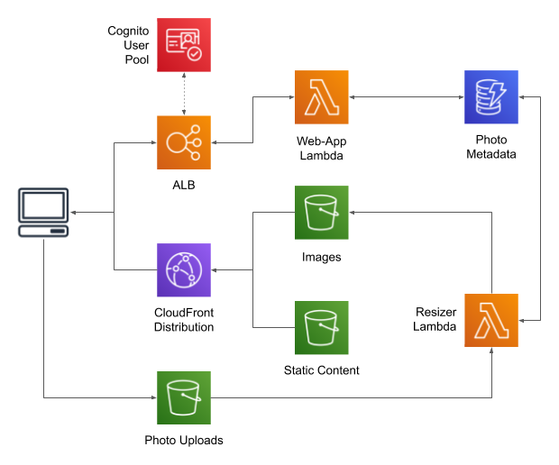

# LambdaPhoto 

This project is a simple photo-sharing site with the following features:

* Self-signup for users.
* Each user can upload as many photos as they want (as long as they're JPEGs).
* Each photo will be resized to some standard "web" sizes.
* Users can share or embed photos via link.

**This is not production-ready code.**

I originally wrote it early in 2017 to support a [talk](docs/jug_presentation.pdf)
for the [Philadelphia Java Users Group](https://www.meetup.com/PhillyJUG/). Recently
(2019) I revisited it to generally clean up the code and use what I believe are
current best-practices (CloudFront/Application Load Balancer rather than API Gateway),
and perhaps use it as the base for a talk on observability in distributed systems. It
also serves as a repository of working CloudFormation snippets (something that I've
found increasingly valuable), and as a place where I can try out new web-app-related
services.

And at this point I should be clear that I don't think Lambda is a good implementation
plaform for a web-app: in the best case (Python or JavaScript, running outside VPC) it
adds a few dozen milliseconds to each request. And Java, with its long cold-start times,
is a particularly bad choice: in my experience the time to first response is around 3-4
seconds (which would cause most users to hit refresh ... queueing up a new Lambda
invocation with its own cold-start). Perhaps [GraalVM](https://www.graalvm.org/) will
make this use-case work, but until then I'll stick with EC2 or ECS as a deployment
platform for Java web-apps.


## Architecture 



The front-end is a fairly standard AWS web-app: CloudFront in front, serving (and caching)
static content from S3 and dynamic content from an Application Load Balancer (ALB). The ALB
is configured to preserve access logs in S3; this is an important part of an observable
deployment.

There are two Lambda functions:

* The [WebApp](docs/webapp.md) handles client API requests.
* The [Resizer](docs/resizer.md) is invoked when a new file is uploaded, to transform the
  image into a set number of sizes. 

A Cognito user pool provides authentication. All interaction with this user pool is via
the web-app, using the Cognito "admin" API. A future revision may offload authentication
to the ALB (but still use Cognito).

User and photo metadata is stored in a DynamoDB table. For more information about the table
design, look [here](docs/database.md).

Photos are stored on S3. Uploads go directly to their own bucket, using a signed URL from
the WebApp Lambda. This avoids the 1MB ALB/Lambda payload limit, and in a traditional web-app
would offload work from the appserver. Once an image has been uploaded, the bucket invokes
the Resizer Lambda, which transforms the image and updates stored metadata.


## What's in the repository

* `README.md`         - This file.
* `docs`              - Additional implementation documentation.
* `scripts`           - Deployment scripts (see below).
* `pom.xml`           - Maven build file.
* `lib-Shared`        - Code that is shared between the WebApp and Resizer (the DynamoDB and S3 code lives here).
* `resizer-Lambda`    - A Lambda function that resizes photos in response to a message on SNS.
* `webapp-Lambda`     - A Lambda function that implements a simple WebApp.
* `webapp-Static`     - Static content for the WebApp.


## Building and Deploying

Deploying the application is a multi-step process. It largely depends on CloudFormation, but
there are a few components that have to be customized or created in advance. Fortunately,
it's all wrapped up in a shell script:

```
Scripts/deploy.sh BASE_NAME BASE_BUCKET_NAME VPC_ID SUBNET_IDS
```

where:

* `BASE_NAME` is a unique name that's used for the stack and all deployed components; I use `LambdaPhoto`.
* `BASE_BUCKET_NAME` is used as the prefix for all buckets used by the application (there are
   five: one each for uploads, images, static content, Lambda deployment, and ALB access logs). This
   name must be unique in all of AWS; I recommend an inverse-hostname such as `com-mycompany-lambdaphoto`.
*  `VPC_ID` and `SUBNET_IDS` are used to deploy the load balancer; the latter is a comma-separated
   list of public subnets within the VPC (eg: `subnet-123456,subnet-789012`).

To run this script you will need to have your default IAM profile configured, either via
`aws configure` or environment variables.

When you run the script, it first builds the project, then creates the buckets and copies the
deployment bundles and static content into them; you'll see various messages as this happens.
The last thing that it does is start building the CloudFormation stack; you'll see a message
like the following:

```
{
    "StackId": "arn:aws:cloudformation:us-east-1:999999999999:stack/Example/a0ccd440-3a37-11e7-89ed-50d5ca6e60e6"
}
```

It will take 20-30 minutes to build the stack, largely due to the CloudFront distribution.


## Shutting Down

**Warning:** a running ALB will cost slighly under $1 per day, and you'll be charged that for
every day that you leave this stack running. To avoid this cost, you can run the shutdown script:

```
Scripts/undeploy.sh STACK_ID
```

where:

* `STACK_ID` is the ID printed when starting the stack (you can also use the stack name).

This script will delete the stack and also all buckets that were created by the `deploy` script.
If you _don't_ want to delete the buckets, delete the stack manually using the AWS Console.


## Useful cURL Commands

When changing the web-app service, I found it's easier if you separate changes to JavaScript
from changes to the Lambda, and use `curl` to exercise the latter. Making this a bit more
challenging is that you need a valid JWT token to be able to do anything. In the following
examples, replace `ENDPOINT` with the address of your load balancer or CloudFront distribution.

* Login

  Additionally replace `USERNAME` and `PASSWORD` with valid entries. Note that the JWT tokens
  are written to a file that will be readable by anyone. If you're concerned about that, use
  a directory that doesn't permit world read or set your `umask` appropriately.

  ```
  curl -v 'https://ENDPOINT/api/signin' -c /tmp/cookies.dat -H 'Content-Type: application/json' --data '{"email":"USERNAME","password":"PASSWORD"}'
  ```

  The response should be `{"data":null,"description":"","responseCode":"SUCCESS"}`, with
  the access and refresh tokens being set as cookies.

  Note that it will take several seconds to start a new Lambda execution environment.

* Request a file upload

  Additionally replace `USERNAME`, `FILENAME, and `DESCRIPTION` with appropriate values.

  ```
  curl -v 'https://ENDPOINT/api/requestUpload' -b /tmp/cookies.dat -c /tmp/cookies.dat -H 'Content-Type: application/json' --data '{"username":"USERNAME","filename":"FILENAME","description":"DESCRIPTION","mimetype":"image/jpeg"}' > /tmp/$$
  ```

  The response will contain the signed URL as its `data` element. Since this URL is long,
  and would become intermingled with the debugging output if sent to the console, it's
  written to a file.

  This is the general format for endpoint requests that require authentication; it uses
  the cookie jar created in the prior step both to provide cookies and receive updated
  cookies.

  If you get an authentication error, verify that cookies are being sent: you should see
  a `Cookie:` line in the log output. If you don't, sign in again and make sure that the
  "cookie jar" (`/tmp/cookies.dat`) has been populated. If you do see a cookie, it's
  possible that you still need to sign in again; otherwise, debug from Lambda logs.

* Upload file content

  Replace `FILENAME` with your source filename, and `SIGNED_URL` with the URL from the
  previous step. Note that the URL has to be enclosed in single quotes to prevent the
  shell from intepreting the numerous `&`s that appear within it. Note also that the
  content type is limited to JPEG images.

  ```
  curl -v -XPUT --data-binary @FILENAME -H 'Content-Type: image/jpeg' 'SIGNED_URL'
  ```
